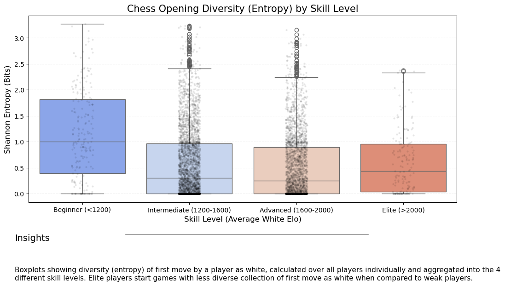
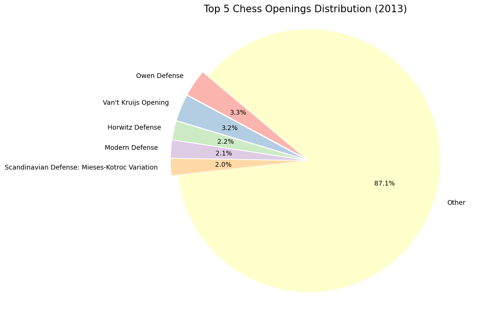
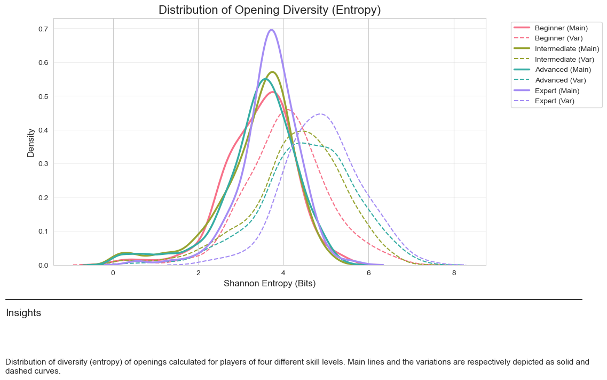
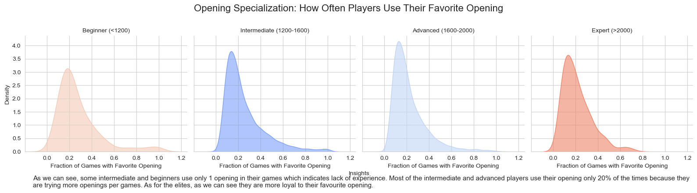
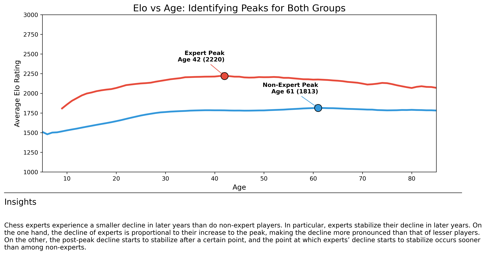
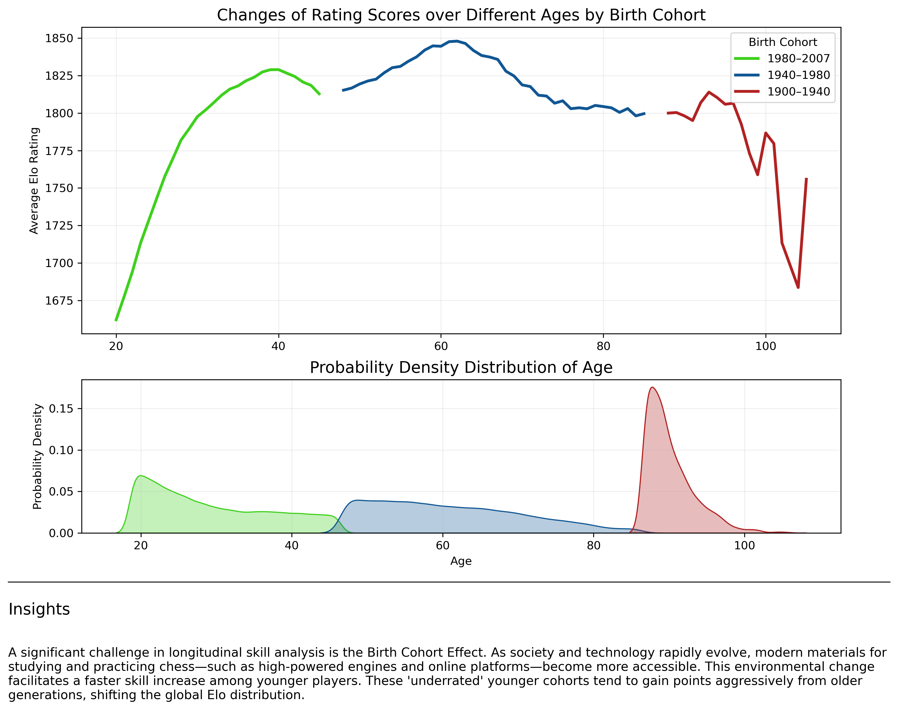

# Lichess-DB-players-performance-analysis-

## 1. Data OverviewSource:

*Lichess Open Database (Standard Rated Games, Jan–Jun 2013).*
*Supplementary Data*: International Chess Federation (FIDE) Blitz rating lists used for cross-referencing skill brackets.Scope: The analysis focuses on the first half of 2013, representing the early developmental phase of the Lichess platform.

## 2. Methodology & Player Selection

In 2013, the Lichess ecosystem was different than it is today; modern "Chess Celebrities" like Magnus Carlsen or Hikaru Nakamura were not yet active on the platform. Consequently, "Elite" players were identified by extracting the top 10 highest-rated accounts within the specific dataset. To provide a comparative analysis of performance patterns, 10 players were also sampled from the Intermediate and Beginner categories.

## 3. Analysis of Performance Streaks (Hot/Cold)

We visualized the win/loss sequences to identify behavioral patterns across different skill levels.

*Elite PlayersObservations* : High-level players exhibit significantly longer winning streaks.

*Psychological Inference* : Players such as brahmsguitar and stoker displayed long winning streaks followed by sudden losing "cold streaks." This suggests a potential "tilt" effect—where the psychological impact of a loss negatively affects subsequent performance—or a regression to the mean after a period of over-performance.

*Proposed Further Research* : Correlation analysis between "Time Between Games" and the onset of losing streaks to determine if player fatigue or long breaks contribute to performance drops.

*Intermediate PlayersObservations*: Intermediate players demonstrate higher game volume than Elites but experience more frequent and volatile losing streaks.

*Finding*: Their performance is less stable, suggesting that while they have mechanical knowledge, they lack the consistency required to maintain the "Elite" status.
(you can find the zoom into details file for the intermediate players plot for a better analysis and observations)

*Beginner PlayersObservations* : This group experienced the longest sustained losing streaks.Interpretation: This is consistent with the "learning phase" of the game, where experimentation and frequent tactical errors lead to high loss frequencies.

## 4. Statistical Analysis

### The Geometric Distribution 

We utilized the Geometric Distribution to model the probability of the number of losses occurring before the first win ($P(X=k) = (1-p)^{k-1}p$).Conclusion: The statistical model confirms that the "Elite" players' success is driven primarily by skill ($p$, the probability of success, is high and consistent).

*Luck vs. Skill* : Conversely, for beginners, the higher number of trials needed to achieve a win suggests that their success is more stochastic (luck-dependent) or inconsistent compared to the high-probability success rate of experienced players.

# opening analysis

## Statistical analysis 

 Chi-Square test was conducted to determine if a significant relationship exists between a player's game outcome (Win/Loss/Draw) and whether they played their Favorite Opening.
 
 *Finding* : The test yielded a significant result ($p < 0.05$), confirming a statistical association between using a favorite opening and the likelihood of winning.Conclusion: This suggests that "Opening Specialization" provides a measurable competitive advantage. Players likely perform better when using their favorite openings because they are more familiar with the resulting middle-game patterns, tactical themes, and endgame transitions. This "home field advantage" in the opening phase allows players to utilize their experience to outmaneuver opponents who may be less familiar with that specific line.

 # Psychology analysis using FIDE data

## Statistical Analysis: Linear Regression of Elo Growth Rates

A linear regression analysis was conducted to model and compare the annual Elo growth rates between two distinct age cohorts. The analysis focused on quantifying how much "rating velocity" (Elo gained per year) differs as players age.

*Finding* : The regression models revealed a significant negative correlation between age and growth rate. Younger players exhibited a substantially steeper upward slope in their performance metrics compared to the older group.

*Conclusion* : Younger players are projected to increase their Elo at a significantly faster rate. This accelerated growth is likely attributed to higher neuroplasticity, greater time availability for deliberate practice, and the "Birth Cohort Effect," where modern training tools allow younger individuals to master complex patterns more efficiently than previous generations.