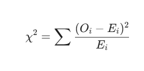

# Geometric distribution 

The geometric distribution is a discrete probability distribution that models the number of independent Bernoulli trials required to achieve the first success. Each trial has the same probability of success, and trials are independent of each other.

The geometric distribution requires three key conditions: independent trials, identical probability of success across all trials, and a fixed probability p where 0 < p ≤ 1. The standard notation uses p for the probability of success and q = 1-p for the probability of failure.

## * PMF *

where k is the number of failures 

## * CDF *

This represents the probability of achieving success within k trials. 

* Calculating the P-Value for a StreakTo determine if a player's max streak *
 * is "extraordinary" or just "luck," *
  calculated the probability of seeing a streak of at least that length.If $n$ is the total number of games and $k$ is the max streak, the expected probability of a streak of length $k$ occurring at least once is approximately:

  you can read this article for more information about the topic : https://arxiv.org/abs/1507.02935

# chi-square statistic and p-value

The Chi-square test of independence is a statistical hypothesis test used to determine whether two categorical or nominal variables are likely to be related or not.

$\chi^2$ : The Pearson Chi-Square test statistic.$O_i$: The Observed frequency (the actual number of wins/losses found in your chess dataset)

$E_i$ : The Expected frequency (the number of wins/losses we would expect to see if there was no relationship between the variables).

$\sum$ : The summation symbol, indicating that we calculate this for every "cell" in our contingency table (e.g., Win/Expert, Loss/Expert, Win/Non-Expert, Loss/Non-Expert) and add them together.

To determine the $p$-value, we must also calculate the degrees of freedom:

$$df = (r - 1) \times (c - 1)$$

Where $r$ is the number of rows and $c$ is the number of columns in your contingency table.